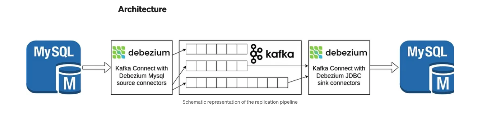
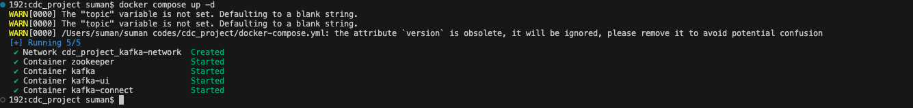
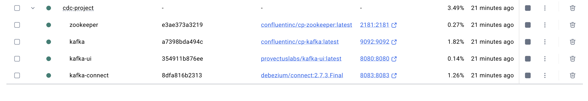
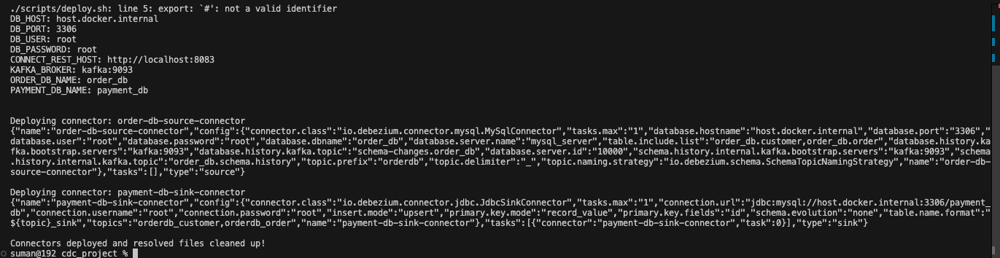
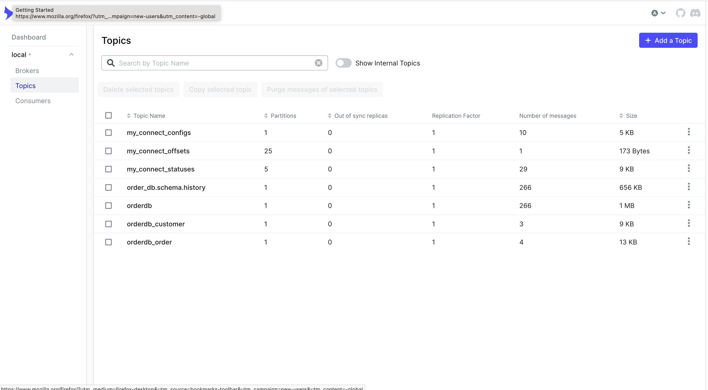

# CDC Project with Kafka and Debezium

This project sets up a **Change Data Capture (CDC)** pipeline using **Apache Kafka**, **Debezium**, and **Kafka Connect**. It captures changes from source databases (e.g., MySQL) and propagates them to target systems via Kafka topics. Kafka connect with debezium jdbc connectors will then sink the message of kafka topics to sink db.




---

## **Prerequisites**
Before running the project, ensure you have the following installed:
- **Docker** and **Docker Compose**
- **curl** (for testing APIs)
- **envsubst** (for environment variable substitution, part of `gettext` package)

---

## **Steps to Run the CDC Project**

### **1. Start the Docker Containers**
Run the following command to start the Kafka, Zookeeper, and Kafka Connect containers:

```bash
docker compose up -d
```

This will start all the services defined in the `docker-compose.yml` file.



You can also verify the running containers in the **Docker Desktop** application:



---

### **2. Deploy the Connectors**
Run the `deploy.sh` script to deploy the Kafka Connect connectors:

```bash
./scripts/deploy.sh
```



If you encounter a **permission denied** error, make the script executable using:

```bash
chmod +x ./scripts/deploy.sh
```

Then, run the script again.

---

### **3. Verify Connector Deployment**
To test if all connectors are registered and running, use the `test-connectors.sh` script:

```bash
./scripts/test-connectors.sh
```


This script will list all registered connectors by querying the Kafka Connect REST API.

---

### **4. Verify CDC Pipeline**
If everything is set up correctly, the CDC pipeline will:
- Capture changes from the source databases (e.g., MySQL).
- Stream these changes to Kafka topics.
- Propagate the changes to the target systems via Kafka Connect sink connectors.

Start testing your pipeline to ensure data is flowing as expected.

---

### **Alternative: Using VS Code Extensions**
You can use the following **VS Code extensions** to simplify the process of running the CDC project:

1. **Docker Extension**:
   - Manage Docker containers and images directly from VS Code.
   - Right-click the `docker-compose.yml` file and select **Compose Up** to start the containers.

2. **Code Runner Extension**:
   - Run shell scripts directly from VS Code.
   - Open the `deploy.sh` or `test-connectors.sh` script and click the **Run** button or use the shortcut **Ctrl+Alt+N** (Windows/Linux) or **Control+Option+N** (macOS).

---

## **Environment Variables**
The `.env` file contains environment-specific configurations. You can modify these variables according to your database setup.

**`.env`**:
```env
# Kafka and Zookeeper Configuration
KAFKA_BROKER=kafka:9093
ZOOKEEPER_HOST=zookeeper:2181

# Database Configuration
DB_HOST=host.docker.internal  # Replace with your database host
DB_PORT=3306                 # Replace with your database port
DB_USER=root                 # Replace with your database username
DB_PASSWORD=root             # Replace with your database password

# Kafka Connect Configuration
CONNECT_REST_HOST=http://localhost:8083
```

- **`DB_HOST`**: The hostname or IP address of your database server.
- **`DB_PORT`**: The port on which your database is running (default is `3306` for MySQL).
- **`DB_USER`**: The username for accessing the database.
- **`DB_PASSWORD`**: The password for accessing the database.

---

## **Apache Kafka UI**
The project includes **Apache Kafka UI**, a web-based interface for managing and monitoring Kafka clusters. You can use it to:
- View Kafka topics and messages.
- Monitor connector statuses.
- Inspect consumer groups and offsets.

### **Access Kafka UI**
1. Open your browser and navigate to:
   ```
   http://localhost:8080
   ```
2. You should see the Kafka UI dashboard, where you can explore topics, messages, and connectors.



---

## **Adding New Connectors**
To add a new connector configuration to the project, follow these steps:

### **1. Create a New Connector Configuration File**
- For **source connectors**, create a new JSON file in the `connectors/source/` directory.
- For **sink connectors**, create a new JSON file in the `connectors/sink/` directory.

#### Example: Adding a New Source Connector
Create a file named `new-source-connector.json` in the `connectors/source/` directory:

```json
{
    "name": "new-source-connector",
    "config": {
        "connector.class": "io.debezium.connector.mysql.MySqlConnector",
        "tasks.max": "1",
        "database.hostname": "${DB_HOST}",
        "database.port": "${DB_PORT}",
        "database.user": "${DB_USER}",
        "database.password": "${DB_PASSWORD}",
        "database.dbname": "new_db",
        "database.server.name": "new_db_server",
        "table.include.list": "new_db.table1,new_db.table2",
        "database.history.kafka.bootstrap.servers": "kafka:9093",
        "database.history.kafka.topic": "schema-changes.new_db",
        "database.server.id": "10002",
        "schema.history.internal.kafka.bootstrap.servers": "kafka:9093",
        "schema.history.internal.kafka.topic": "newdb.schema.history",
        "topic.prefix": "newdb",
        "topic.delimiter": "_",
        "topic.naming.strategy": "io.debezium.schema.SchemaTopicNamingStrategy"
    }
}
```

#### Example: Adding a New Sink Connector
Create a file named `new-sink-connector.json` in the `connectors/sink/` directory:

```json
{
    "name": "new-sink-connector",
    "config": {
        "connector.class": "io.debezium.connector.jdbc.JdbcSinkConnector",
        "tasks.max": "1",
        "connection.url": "jdbc:mysql://${DB_HOST}:${DB_PORT}/target_db",
        "connection.username": "${DB_USER}",
        "connection.password": "${DB_PASSWORD}",
        "insert.mode": "upsert",
        "primary.key.mode": "record_value",
        "primary.key.fields": "id",
        "schema.evolution": "none",
        "table.name.format": "${topic}_sink",
        "topics": "newdb_table1,newdb_table2"
    }
}
```

---

### **2. Update the `deploy.sh` Script**
Add the new connector to the `deploy.sh` script to ensure it is deployed automatically:

```bash
#!/bin/bash

# Load environment variables
if [ -f .env ]; then
  export $(grep -v '^#' .env | xargs)
else
  echo "Error: .env file not found."
  exit 1
fi

# Substitute environment variables in JSON files
envsubst < connectors/source/new-source-connector.json > connectors/source/new-source-connector-resolved.json
envsubst < connectors/sink/new-sink-connector.json > connectors/sink/new-sink-connector-resolved.json

# Deploy the new connectors
curl -X POST -H "Content-Type: application/json" --data @connectors/source/new-source-connector-resolved.json ${CONNECT_REST_HOST}/connectors
curl -X POST -H "Content-Type: application/json" --data @connectors/sink/new-sink-connector-resolved.json ${CONNECT_REST_HOST}/connectors

# Clean up resolved files
rm connectors/source/new-source-connector-resolved.json
rm connectors/sink/new-sink-connector-resolved.json

echo "New connectors deployed and resolved files cleaned up!"
```

---

### **3. Deploy the New Connectors**
Run the `deploy.sh` script to deploy the new connectors:

```bash
./scripts/deploy.sh
```

---

### **4. Verify the New Connectors**
Use the `test-connectors.sh` script to verify that the new connectors are registered and running:

```bash
./scripts/test-connectors.sh
```

---

## **Project Structure**
The project is organized as follows:

```
cdc-project/
├── docker-compose.yml            # Docker Compose configuration
├── .env                          # Environment variables
├── connectors/                   # Connector configurations
│   ├── source/                   # Source connector configurations
│   └── sink/                     # Sink connector configurations
├── scripts/                      # Utility scripts
│   ├── deploy.sh                 # Script to deploy connectors
│   └── test-connectors.sh        # Script to test connector status
└── README.md                     # Project documentation
```

---

## **Troubleshooting**

### **Permission Denied Error**
If you encounter a `permission denied` error when running scripts, ensure the script is executable:

```bash
chmod +x ./scripts/deploy.sh
```

### **Environment Variables Not Resolved**
If environment variables (e.g., `${DB_HOST}`) are not being resolved, ensure:
1. The `.env` file is correctly formatted and located in the project root.
2. The `envsubst` command is installed and working.

---

## **Cleanup**
To stop and remove all Docker containers, run:

```bash
docker compose down
```

---